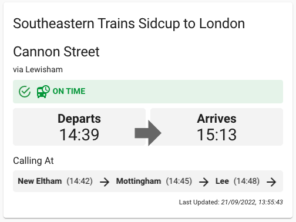
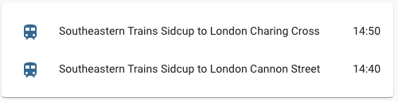
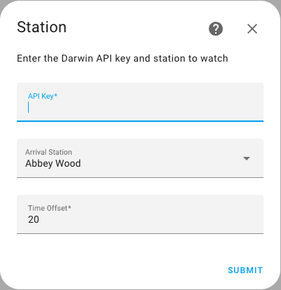
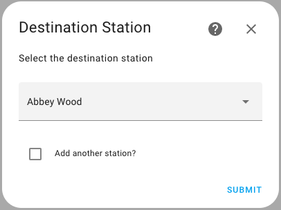

# National Rail Departure Times Integration Component by [@crismc](https://github.com/crismc)
[](https://my.home-assistant.io/redirect/config_flow_start/?domain=nationalrailtimes)

<a href="https://www.buymeacoffee.com/jedimeat" target="_blank"></a>

[![hacs][hacs-badge]][hacs-url]
[![release][release-badge]][release-url]
![downloads][downloads-badge]

A custom Home Assistant component to show next available trains to specific stops through the National Rail Darwin SOAP API.
For better visuals, to be used with the Home Assistant custom card homeassistant_nationalrailtimes_lovelace (https://github.com/crismc/homeassistant_nationalrailtimes_lovelace)

Creates a sensor for each station/destination, reporting arrival/destination times, and relevant calling stops along the way coupled with any station messages such as delayed or cancelled services.

Based on the HA-LondonTfl component by [@morosanmihail] (https://github.com/morosanmihail/HA-LondonTfL), although the internals have taken a side step to incorporate the Darwin SOAP API.

This can be used for any/all stations associated to the National Rail service, and returns service information associated to the GetNextDeparturesWithDetailsRequest.
For information on the SOAP API, visit [Live Departure Boards Web Service (LDBWS / OpenLDBWS)](https://lite.realtime.nationalrail.co.uk/openldbws/)





## Requirements
As this component intracts with the National Rail Darwin Feed, this requires an API Key to access the LDB Webservice (PV) SOAP API:
https://www.nationalrail.co.uk/100296.aspx

Simply go to the above link and choose [Register Here](http://realtime.nationalrail.co.uk/OpenLDBWSRegistration/Registration) next to LDB Webservice (PV)

## Options

| Name                 | Type    | Requirement  | Description                                                                                       | Default |
| ---------------------| ------- |--------------| --------------------------------------------------------------------------------------------------|---------|
| api_key              | string  | **Required** | National Rail Darwin Feed API Key                                                                 | `none`  |
| arrival              | string  | **Required** | 3 Letter CRX station code of your local station                                                   | `none`  |
| destination          | string  | **Required** | 3 Letter CRX station code of your target destination station                                      | `none`  |
| time_offset          | string  | **Optional** | An offset in minutes against the current time to provide the station board for your local station | `none`  |


## Installing via HACS
The easiest way to install this integration component is to install via HACS:
1) Simply go to HACS in your Home Assistant
2) Select Integrations
3) In the top right of the screen, select the 3 dots and choose 'Custom repositories'
4) For the repository field enter 'https://github.com/crismc/homeassistant_nationalrailtimes_integration'
5) Choose 'Integration' as the category
6) Add
7) Restart your HomeAssistant
8) Add Integration or Explore & Download Repositories (depending on your version of Home Assistant)
9) Search for 'National Rail Departure Times'
9) Enjoy

## Installing the component from source
Simply clone the repository, and manually drop the custom_components/nationalrailtimes directory it into your custom_components folder, and restart your Home Assistant configuration.

```
git clone git@github.com:crismc/homeassistant_nationalrailtimes_integration.git
cd homeassistant_nationalrailtimes_integration
cp -r custom_components/nationalrailtimes /your/homeassistant/conf/custom_components
```

### Setup


You can add integration via the Integrations menu by searching for `National Rail Departure Times`.
It will ask for an API Key, provide a list of stations to set as your local arrival station, and allow you to set the time offset.



Next, it will allow you to add your destination station.
By selecting "Add Another", you can add more destination stations.

Each destination will be created as its own sensor.

Sensor name will change to the name of the local and destination station.

### Alternate setup

Alternatively, you can set it up manually in your `configuration.yaml`.

If configuring this directly within `configuration.yaml`, you will also need to know your stations 3 letter CRX codes. These can be found [here](https://www.nationalrail.co.uk/stations_destinations/48541.aspx)

Demo configuration:

```
sensor:
  - platform: nationalrailtimes
    api_key: 1234abcd-1a2b3c-1a2b-9876-123abc456def
    arrival: CHX
    destination: ABW
  - platform: nationalrailtimes
    api_key: 1234abcd-1a2b3c-1a2b-9876-123abc456def
    arrival: ABW
    destination: CHX
    time_offset: 20
```

<!-- Badges -->
[license-shield]: https://img.shields.io/github/license/custom-cards/boilerplate-card.svg?style=for-the-badge
[hacs-badge]: https://img.shields.io/badge/hacs-default-orange.svg?style=flat-square
[release-badge]: https://img.shields.io/github/v/release/crismc/homeassistant_nationalrailtimes_integration?style=flat-square
[downloads-badge]: https://img.shields.io/github/downloads/crismc/homeassistant_nationalrailtimes_integration/total?style=flat-square

<!-- References -->
[hacs-url]: https://github.com/hacs/integration
[hacs]: https://hacs.xyz
[ui-lovelace-minimalist]: https://ui-lovelace-minimalist.github.io/UI/
[release-url]: https://github.com/crismc/homeassistant_nationalrailtimes_integration/releases